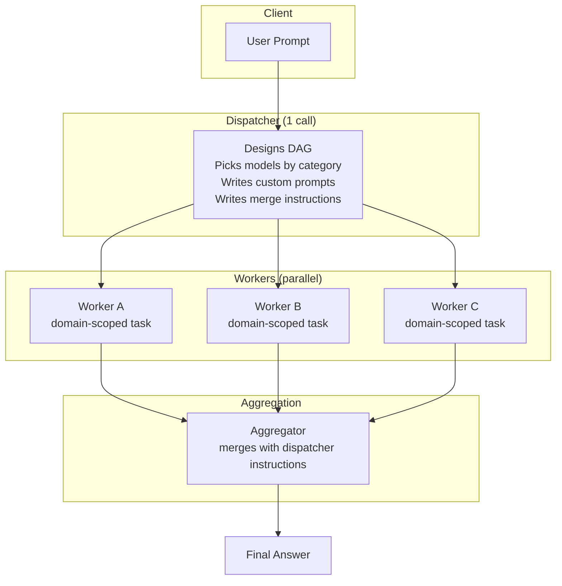
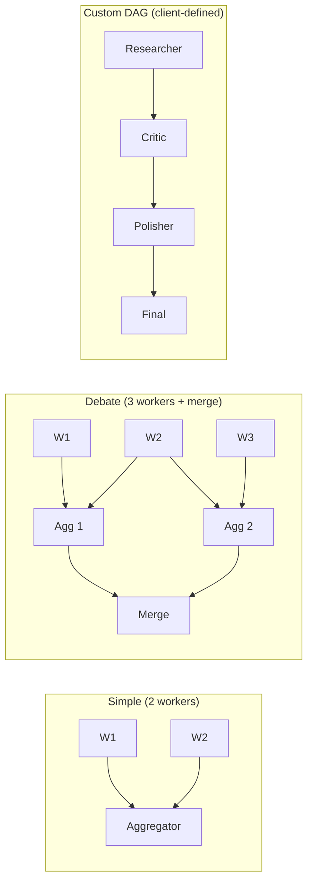
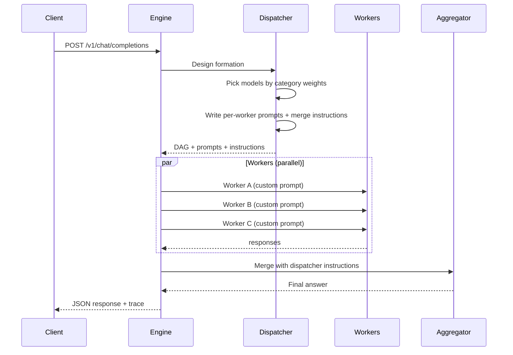

# Chimera — Dynamic Multi-Model Deliberation Gateway

One API call. A team of models. One answer.

Chimera takes your prompt, dispatches it to a hand-picked team of LLMs (each with
a custom subtask scoped to their strengths), and an aggregator merges their outputs
using dispatcher-written instructions. One dispatcher model call designs the entire
deliberation at once.

## Architecture



## Formation Types



## Flow: Request to Answer



## Quick Start

```bash
# Install
pipx install chimera[full]

# Configure
cp chimera.yaml.example chimera.yaml
# Edit chimera.yaml with your API keys

# Run
chimera deliberate "Compare React, Vue, and Svelte for a real-time dashboard"

# Or as an API server
chimera serve
# → http://localhost:8000/v1/chat/completions (OpenAI-compatible)
# → http://localhost:8000/docs (OpenAPI docs)

# Or as MCP server for Hermes/AI agents
chimera-mcp
```

## Model Selection

The dispatcher picks models using **category-weighted scoring**:

| Category | What it measures |
|---|---|
| `code` | Programming, debugging, software engineering |
| `analysis` | Data analysis, research, evaluation |
| `reasoning` | Logic, math, complex problem-solving |
| `design` | Creative work, UX, content generation |
| `audit` | Fact-checking, safety, correctness review |

Each model in the catalog has a score (0.0–1.0) per category. The dispatcher matches
task domains to model strengths. You can override any model choice per request:

```json
{
  "model": "auto",
  "messages": [{"role": "user", "content": "..."}],
  "dispatcher_model": "deepseek/deepseek-v4-flash",
  "allowed_models": ["deepseek/deepseek-v4-pro", "z-ai/glm-5.2"],
  "stage_models": {"worker_1": "openrouter/anthropic/claude-sonnet-4"}
}
```

## Custom DAGs

Send your own formation structure at request time:

```json
{
  "model": "custom",
  "allow_custom_dag": true,
  "dag": {
    "stages": [
      {"id": "researcher", "kind": "worker", "model": "openrouter/anthropic/claude-sonnet-4"},
      {"id": "critic", "kind": "aggregator", "model": "z-ai/glm-5.2", "depends_on": ["researcher"]},
      {"id": "polisher", "kind": "worker", "model": "deepseek/deepseek-v4-pro", "depends_on": ["critic"]},
      {"id": "final", "kind": "aggregator", "model": "openrouter/anthropic/claude-sonnet-4", "depends_on": ["polisher"]}
    ],
    "edges": [["researcher","critic"], ["critic","polisher"], ["polisher","final"]]
  },
  "messages": [{"role": "user", "content": "..."}]
}
```

The dispatcher writes custom prompts for each stage but uses YOUR structure exactly.

## Interfaces

| Interface | Endpoint | Use |
|---|---|---|
| **REST API** | `POST /v1/chat/completions` | OpenAI-compatible drop-in |
| **REST API** | `POST /v1/deliberate` | Full control (DAG, overrides, trace) |
| **REST API** | `GET /v1/models` | Model catalog with weights |
| **REST API** | `GET /v1/formations` | Available formation presets |
| **CLI** | `chimera deliberate` | Command-line usage |
| **MCP** | `chimera_deliberate` | Hermes / AI agent integration |

## Response Trace

Every deliberation returns a full trace:

```
request_id: a71b3f2c...
formation: auto
source: auto        ← not "fallback" — dispatcher designed it
total_tokens: 12345
total_cost: $0.012
total_duration_ms: 15234

dispatch: V4 Flash (1,234ms, 800+420 tok)
workers:
  worker_rust: Claude Sonnet 4 (4,500ms, 300+1,200 tok)
  worker_go: Kimi K2.7 (8,200ms, 250+800 tok)
aggregator: V4 Flash (2,100ms, 3,000+500 tok)
```

## Providers

Chimera uses LiteLLM under the hood. Supported providers:

| Provider | Direct API | Via OpenRouter | Models |
|---|---|---|---|
| **DeepSeek** | ✅ | ✅ | v4-flash, v4-pro, r1 |
| **Anthropic** | — | ✅ | Sonnet 4, Opus 4.7/4.8, Haiku 4.5 |
| **OpenAI** | — | ✅ | GPT-5.5, GPT-5.1 |
| **xAI** | — | ✅ | Grok 4.20 |
| **Google** | — | ✅ | Gemini 3.5 Flash, 3.1 Pro, 2.5 Flash |
| **Z.AI** | ✅ (direct) | ✅ | GLM-5.2 |
| **MoonshotAI** | — | ✅ | Kimi K2.7 Code, K2.6 |
| **MiniMax** | — | ✅ | M3 |
| **Meta** | — | ✅ | Llama 4 Maverick |
