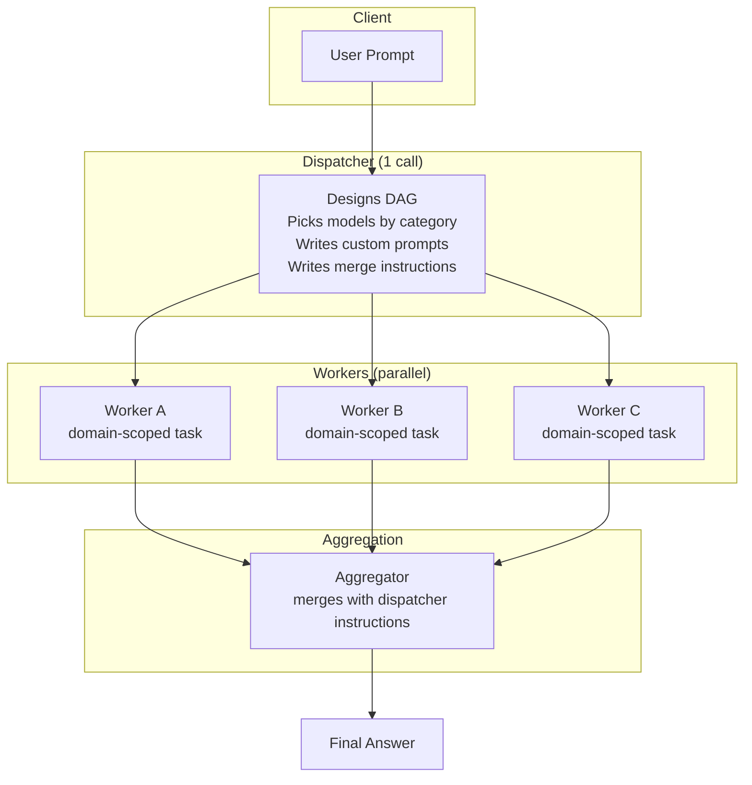
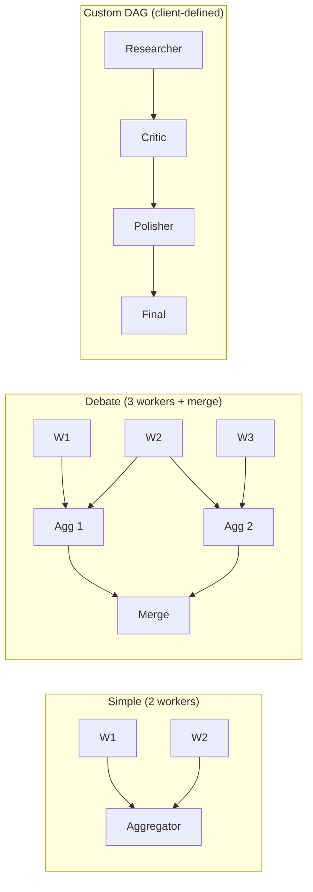
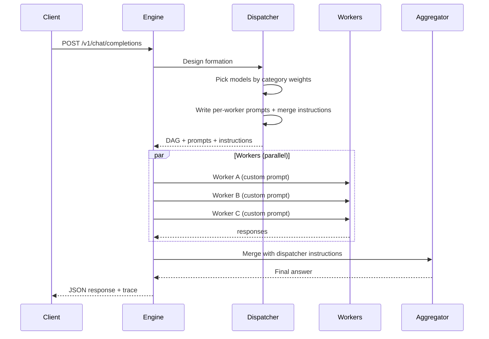

# Chimera — Dynamic Multi-Model Deliberation Gateway


[](https://github.com/totalwindupflightsystems/chimera/actions/workflows/ci.yml)
[](https://pypi.org/project/chimera-deliberation/)
[](https://opensource.org/licenses/MIT)
[](https://www.python.org/downloads/)

One API call. A team of models. One answer.

Chimera takes your prompt, dispatches it to a hand-picked team of LLMs (each with
a custom subtask scoped to their strengths), and an aggregator merges their outputs
using dispatcher-written instructions. One dispatcher model call designs the entire
deliberation at once.

## Quickstart

```bash
# Install (choose one)
pip install chimera-deliberation[full]        # full CLI + server in a venv
pipx install chimera-deliberation[full]       # same, isolated in its own env
pip install chimera-deliberation[server]      # API server only

# Configure — the repo ships NO chimera.yaml. Your live config is local-only
# (gitignored, never committed), so a fresh clone has none — create it:
chimera config init                           # copies chimera.yaml.example → chimera.yaml
# (from a repo checkout: cp chimera.yaml.example chimera.yaml works too)
# Add your API keys (at minimum: DEEPSEEK_API_KEY)

# Run
chimera "What is the capital of France?"      # CLI deliberation
chimera run "Compare React and Vue"           # explicit `run` subcommand (same as above)
chimera --quiet "Compare React and Vue"       # stdout = the raw answer only
chimera --json "Compare React and Vue"        # stdout = one JSON object (answer + trace)
chimera --formation simple "Compare …"        # pick a formation (an unknown name exits 2)
chimera --version                             # print the package version
chimera serve                                 # REST API + web UI (see Server & MCP)
chimera-mcp                                   # MCP tools for agents
python -m chimera --version                   # fallback when the `chimera` script is not on PATH (fresh clone, non-activated venv, bare wheel)
```

### Machine-readable output

`--quiet` and `--json` are mutually exclusive group flags — place them
BEFORE the subcommand. Both work for the implicit-prompt form and the
explicit `run` form, and in both modes stdout carries exactly ONE payload
(diagnostics and logs stay on stderr):

```bash
chimera --quiet "Summarize this changelog"        # stdout: the answer + "\n"
chimera --quiet run "Summarize this changelog"    # same, explicit run form
ANSWER=$(chimera --quiet "Name one HTTP status code for 'not found'")

chimera --json "Compare React and Vue" | jq .answer
chimera --json run "Compare React and Vue" | jq '.trace.total_tokens'
```

`--json` writes one object per invocation (span fields abridged here for
readability — the real trace is the complete `DeliberationTrace` dump):

```json
{
  "answer": "merged output from multiple models",
  "trace": {
    "request_id": "a71b3f2c...",
    "formation": "auto",
    "source": "auto",
    "dispatch": {"stage_id": "dispatch", "kind": "dispatch", "model": "deepseek/deepseek-v4-flash", "latency_ms": 1234},
    "stages": [{"stage_id": "worker_1", "kind": "worker", "model": "anthropic/claude-sonnet-4", "tokens_input": 300, "tokens_output": 1200}],
    "aggregator": {"stage_id": "aggregator", "kind": "aggregator", "model": "deepseek/deepseek-v4-flash"},
    "answer_stage_id": "aggregator",
    "total_tokens": 12345,
    "total_cost": 0.012,
    "total_duration_ms": 15234,
    "worker_failures": [],
    "dispatch_note": null
  }
}
```

The `trace` value is the COMPLETE trace serialization (`model_dump(mode="json")`)
— the same object the REST API returns. Unicode answers are preserved
(`ensure_ascii=False`), so `café` stays `café`.

Operational warnings are never suppressed: dropped-worker and
dispatch-degradation/repair warnings (which the human mode prints next to the
panel) move to **stderr** under `--quiet` / `--json`, so
`chimera --json "..." > out.json` cannot be corrupted. Combining both flags is
a usage error (exit code 2); `--verbose` is ignored in the machine modes.
The flags cover deliberation output — `chimera models` / `chimera formations`
tables are unchanged (use `GET /v1/models` / `GET /v1/formations` for a
machine-readable catalog).

Open http://localhost:8765/web/ for the web UI with live DAG visualization.

**Python:**
```bash
# If chimera.yaml is missing, create it before calling load_config():
chimera config init        # finds the template: local copy, wheel copy, or repo checkout
# Missing template? Copy chimera.yaml.example from a repo checkout or reinstall:
# error: chimera.yaml.example not found — copy the template from a chimera-v2 repo checkout (chimera.yaml.example at the repo root) or reinstall chimera-deliberation to restore the packaged template.
```
`load_config()` finds the config in this order: explicit `path` argument, then the `CHIMERA_CONFIG` env var, then a walk-up from the current directory.

```python
import asyncio

from chimera import Engine, LiteLLMGateway, load_config

config = load_config()
engine = Engine(config, LiteLLMGateway(config))
result = asyncio.run(engine.deliberate("Explain quantum computing."))
print(result.answer)  # merged output from multiple models
```

**OpenAI-compatible:**
```bash
curl -X POST http://localhost:8765/v1/chat/completions \
  -H "Content-Type: application/json" \
  -d '{"model": "auto", "messages": [{"role": "user", "content": "Hello"}]}'
```

## Configuration

`chimera.yaml` is found in this order: an explicit `path` argument, then the
`CHIMERA_CONFIG` env var, then a walk-up from the current directory.

### `${VAR}` environment-variable substitution

Any string in `chimera.yaml` may reference an environment variable as
`${VAR}`. Tokens are substituted **at load time** from the process
environment, so no API key has to be written into the YAML:

```yaml
api_keys:
  deepseek: "${DEEPSEEK_API_KEY}"
  openrouter: "${OPENROUTER_API_KEY}"
```

A token is resolved from, in order:

1. the process environment;
2. `~/.hermes/.env` (Hermes' dotenv file), as a fallback for variables that
   are not in the process environment — so cron/agent sessions resolve keys
   they never exported.

A variable that resolves nowhere is replaced with the **empty string**: the
config still loads, but every call to that provider fails auth. Substitution
is recursive — it applies to nested mappings and list items, not just
top-level scalars.

### `.env` auto-load

Before substitution, `load_config()` loads a `.env` file sitting **next to
`chimera.yaml`** into the process environment. It is best-effort: only
variables that are not already set are populated (the real environment keeps
precedence), and a missing file, a missing `python-dotenv`, or a malformed
file is tolerated (logged, never fatal). Full key resolution order:

```
process environment  >  repo .env (next to chimera.yaml)  >  ~/.hermes/.env
```

### Environment-variable overrides

Common knobs can be set from the environment instead of editing the YAML
(env vars win):

- `CHIMERA_CONFIG` — config file path
- `CHIMERA_HOST`, `CHIMERA_PORT` — server bind address
- `CHIMERA_DISPATCHER`, `CHIMERA_WORKER`, `CHIMERA_AGGREGATOR` — model defaults
- `CHIMERA_LOG_LEVEL` — observability log level
- `CHIMERA_AUTH_ENABLED`, `CHIMERA_RATE_LIMIT_ENABLED`,
  `CHIMERA_AUTO_ALLOW_ALL_CATALOG` — `"true"` / `"1"` to enable
- `DEEPSEEK_KEY` / `DEEPSEEK_API_KEY`, `OPENROUTER_KEY` / `OPENROUTER_API_KEY`,
  `OPENAI_*`, `XAI_*`, `ZAI_*`, `ANTHROPIC_*`, `GEMINI_*` — populate
  `api_keys.*` for that provider

### First-run remedies

| Symptom | The message names | Do this |
|---|---|---|
| `error: No chimera.yaml found. …` (one line, exit 2, no traceback) | `chimera config init` | Run `chimera config init` — it bootstraps `chimera.yaml` from the shipped `chimera.yaml.example` (local copy, repo checkout, or the copy inside the installed wheel, so a bare `pip install` works). `--force` overwrites an existing file. |
| A provider rejects the call (`401`, `Missing credentials`, `invalid api key`) | the provider **and its own env var**, e.g. `provider 'deepseek' rejected the credentials or none were found: set DEEPSEEK_API_KEY` | Set that variable (or your `providers.<name>.api_key_env`) and re-run. |

The env var is resolved from the provider that actually served the model —
`providers.<name>.api_key_env` if set, else the canonical name in the table
above (`google` → `GEMINI_API_KEY`), else `<PROVIDER>_API_KEY`. LiteLLM's own
error prose is provider-blind (a DeepSeek call is served through the OpenAI
SDK and mentions `OPENAI_API_KEY`), so Chimera puts its accurate remedy in
front of it on every surface: CLI, REST body, MCP tool result, trace and logs.
Keyless loopback providers (`lmstudio`, `ollama`) keep their raw error text —
Chimera never names a key variable for an endpoint that needs none. A custom
`base_url` provider follows the same rule: a failure from the Hermes gateway
names `API_SERVER_KEY`, because that is what `providers.hermes.api_key_env`
declares — not `OPENAI_API_KEY`, even though the call itself is served over
the OpenAI SDK.

See [docs/CONFIG.md](docs/CONFIG.md#first-run-remedies) for the full chain.

## Documentation

Detailed guides live in `docs/`:

| Guide | Contents |
|---|---|
| [docs/CONFIG.md](docs/CONFIG.md) | Full configuration reference (`chimera.yaml`, categories, model selection) |
| [docs/USAGE.md](docs/USAGE.md) | CLI usage and examples |
| [docs/INTEGRATION.md](docs/INTEGRATION.md) | Integrate Chimera into your app (deployment, clients, auth, errors) |
| [docs/OPENAI_API.md](docs/OPENAI_API.md) | OpenAI-compatible API contract |
| [docs/SECURITY.md](docs/SECURITY.md) | Security model and credential handling |
| [docs/EDGE_CASES.md](docs/EDGE_CASES.md) | Edge cases and behavior notes |
| [docs/FAILURE_RESILIENCE.md](docs/FAILURE_RESILIENCE.md) | Failure handling and resilience design |
| [docs/RESILIENCE.md](docs/RESILIENCE.md) | Resilience guarantees and degradation semantics |
| [docs/LOCAL_CI.md](docs/LOCAL_CI.md) | Run the CI suite locally with `act` (ruff + tests, same workflow as CI) |

*Full docs index, including historical artifacts and dogfood logs: [docs/README.md](docs/README.md).*

## Architecture


```mermaid
flowchart TB
    subgraph Client
        A[User Prompt]
    end

    subgraph Dispatcher["Dispatcher (1 call)"]
        B[Designs DAG<br/>Picks models by category<br/>Writes custom prompts<br/>Writes merge instructions]
    end

    subgraph Workers["Workers (parallel)"]
        C1[Worker A<br/>domain-scoped task]
        C2[Worker B<br/>domain-scoped task]
        C3[Worker C<br/>domain-scoped task]
    end

    subgraph Aggregation
        D[Aggregator<br/>merges with dispatcher instructions]
    end

    A --> B
    B --> C1
    B --> C2
    B --> C3
    C1 --> D
    C2 --> D
    C3 --> D
    D --> E[Final Answer]
```

## Formation Types


```mermaid
flowchart LR
    subgraph Simple["Simple (2 workers)"]
        S1[W1] --> SA[Aggregator]
        S2[W2] --> SA
    end

    subgraph Debate["Debate (3 workers + merge)"]
        D1[W1] --> DA1[Agg 1]
        D2[W2] --> DA1
        D2 --> DA2[Agg 2]
        D3[W3] --> DA2
        DA1 --> DM[Merge]
        DA2 --> DM
    end

    subgraph Custom["Custom DAG (client-defined)"]
        C1[Researcher] --> C2[Critic]
        C2 --> C3[Polisher]
        C3 --> C4[Final]
    end
```

## Flow: Request to Answer


```mermaid
sequenceDiagram
    participant Client
    participant Engine
    participant Dispatcher
    participant Workers
    participant Aggregator

    Client->>Engine: POST /v1/chat/completions
    Engine->>Dispatcher: Design formation
    Dispatcher->>Dispatcher: Pick models by category weights
    Dispatcher->>Dispatcher: Write per-worker prompts + merge instructions
    Dispatcher-->>Engine: DAG + prompts + instructions

    par Workers (parallel)
        Engine->>Workers: Worker A (custom prompt)
        Engine->>Workers: Worker B (custom prompt)
        Engine->>Workers: Worker C (custom prompt)
        Workers-->>Engine: responses
    end

    Engine->>Aggregator: Merge with dispatcher instructions
    Aggregator-->>Engine: Final answer

    Engine-->>Client: JSON response + trace
```

## Server & MCP

`chimera serve` starts the REST API plus the web UI:

- http://localhost:8765/v1/chat/completions — OpenAI-compatible endpoint
- http://localhost:8765/docs — OpenAPI docs
- http://localhost:8765/web/ — web UI with live DAG visualization

Health probes (all return JSON):

- http://localhost:8765/health — alias of the liveness probe (always 200 when the process is alive)
- http://localhost:8765/v1/health — health check (`healthy` / `degraded`); see below
- http://localhost:8765/v1/health/ready — readiness probe (200 when ≥1 provider reachable, 503 otherwise)
- http://localhost:8765/v1/health/live — liveness probe (always 200 when alive)

**`/v1/health` status semantics.** `healthy` means every configured provider's
live probe succeeded. `degraded` means **at least one provider probe failed** —
missing credentials, an auth error (`401`/`403`), an API error, a probe
timeout, or an exception inside the check itself. The endpoint always answers
**HTTP 200** and reports the verdict in the `status` field (plus a `details`
object with per-provider `healthy` / `error` / `model_tested`), so monitoring
must read `status`, not the HTTP code. Any probe failure — including "all
providers failed" — reports `degraded`; the `unhealthy` value is declared in
the server docstring but is not currently emitted.

**The provider probe costs money.** Each `/v1/health` (and `/v1/health/ready`)
call runs a **real** completion per configured provider — `gateway.complete(model,
"ping", max_tokens=1)` — so it consumes a (small) number of tokens on every
provider it can reach, and takes real latency. Details worth knowing before you
poll it in a tight loop:

- providers with no resolvable credentials are reported immediately
  (`missing-credentials`) with **no** live call;
- on a non-timeout failure up to **3** models of that provider are tried before
  it is marked unhealthy (one blocked model does not condemn the provider);
  a timeout is terminal for that provider after one model;
- probes run concurrently, bounded by `server.health_timeout_s` (default
  `10.0` s); providers still pending at that bound are reported unhealthy with
  a `timeout:` error. Slow tail latency is therefore indistinguishable from a
  dead provider — raise `server.health_timeout_s` if your provider is merely slow.

`chimera-mcp` runs the MCP server over stdio so AI agents (Hermes, Claude
Code, etc.) can call Chimera directly. Both read the same `chimera.yaml`
configured in Quickstart.

### Live smoke test

`/v1/health` reporting `healthy` does not prove a deliberation works (billing,
auth and prompt-format regressions only surface on a real call). Run the live
smoke test after a deploy:

```bash
python scripts/smoke_live.py --base-url http://localhost:8765     # default base URL
python scripts/smoke_live.py --base-url http://myhost:8765 --formation auto
CHIMERA_API_KEY=... python scripts/smoke_live.py --base-url http://myhost:8765   # if auth is enabled
```

The flag is `--base-url` (there is no `--port`); `CHIMERA_BASE_URL` is the env
default. Other flags: `--formation` (default `simple`), `--prompt`,
`--api-key`, `--timeout`. The script checks liveness + running commit (warning
when the deployed commit diverges from local HEAD), probes `/v1/health`, then
POSTs a real `/v1/deliberate` and prints the merged answer. Exit `0` = merged
answer received, `1` = failure with an actionable message, `2` = usage/config
error. Stdlib-only.

## Model Selection

The dispatcher picks models using **category-weighted scoring**:

| Category | What it measures |
|---|---|
| `code` | Programming, debugging, software engineering |
| `analysis` | Data analysis, research, evaluation |
| `reasoning` | Logic, math, complex problem-solving |
| `design` | Creative work, UX, content generation |
| `audit` | Fact-checking, safety, correctness review |

Each model in the catalog has a score (0.0–1.0) per category. The dispatcher matches
task domains to model strengths. You can override any model choice per request:

```json
{
  "model": "auto",
  "messages": [{"role": "user", "content": "..."}],
  "dispatcher_model": "deepseek/deepseek-v4-flash",
  "aggregator_model": "z-ai/glm-5.2",
  "worker_model": "deepseek/deepseek-v4-pro",
  "allowed_models": ["deepseek/deepseek-v4-pro", "z-ai/glm-5.2"],
  "stage_models": {"worker_1": "openrouter/anthropic/claude-sonnet-4"}
}
```

* `dispatcher_model` — model for the planning/dispatch call itself.
* `aggregator_model` — forces every aggregator/merge/audit stage.
* `worker_model` — forces every worker stage.
* `stage_models` — per-stage overrides; these **win over** the global ones above.
* Config locks (`defaults.lock_aggregator: true` / `defaults.lock_dispatcher: true`)
  force the configured default for that role and discard the request override. A
  discarded override is never silent: it is recorded in the trace's `dispatch_note`
  (e.g. `override discarded: aggregator_model='X' ignored (lock_aggregator=true)`).

## Custom DAGs

Send your own formation structure at request time. The example below is the
complete request body for **POST /v1/chat/completions** with
`"model": "custom"` — that endpoint is the custom-DAG contract
(`POST /v1/deliberate` does not accept formation `custom`):

```json
{
  "model": "custom",
  "allow_custom_dag": true,
  "dag": {
    "stages": [
      {"id": "researcher", "kind": "worker", "model": "openrouter/anthropic/claude-sonnet-4"},
      {"id": "critic", "kind": "aggregator", "model": "z-ai/glm-5.2", "depends_on": ["researcher"]},
      {"id": "polisher", "kind": "worker", "model": "deepseek/deepseek-v4-pro", "depends_on": ["critic"]},
      {"id": "final", "kind": "aggregator", "model": "openrouter/anthropic/claude-sonnet-4", "depends_on": ["polisher"]}
    ],
    "edges": [["researcher","critic"], ["critic","polisher"], ["polisher","final"]]
  },
  "messages": [{"role": "user", "content": "..."}]
}
```

The dispatcher writes custom prompts for each stage but uses YOUR structure exactly.

## Interfaces

| Interface | Endpoint | Use |
|---|---|---|
| **REST API** | `POST /v1/chat/completions` | OpenAI-compatible drop-in |
| **REST API** | `POST /v1/deliberate` | Full control (DAG, overrides, trace) |
| **REST API** | `GET /v1/models` | Model catalog with weights |
| **REST API** | `GET /v1/formations` | Available formation presets |
| **CLI** | `chimera run` | Command-line usage (add `--quiet` / `--json` for machine-readable output, `--version` for the package version) |
| **MCP** | `chimera_deliberate` | Run a deliberation from an agent |
| **MCP** | `chimera_formations` | List formation presets |
| **MCP** | `chimera_models` | List models with weights |

## Response Trace

Every deliberation returns a full trace:

```
request_id: a71b3f2c...
formation: auto
source: auto        ← not "fallback" — dispatcher designed it
total_tokens: 12345
total_cost: $0.012
total_duration_ms: 15234

dispatch: V4 Flash (1,234ms, 800+420 tok)
workers:
  worker_rust: Claude Sonnet 4 (4,500ms, 300+1,200 tok)
  worker_go: Kimi K2.7 (8,200ms, 250+800 tok)
aggregator: V4 Flash (2,100ms, 3,000+500 tok)
```

## Providers

Chimera uses LiteLLM under the hood. Supported providers:

| Provider | Direct API | Via OpenRouter | Models |
|---|---|---|---|
| **DeepSeek** | ✅ | ✅ | v4-flash, v4-pro, r1 |
| **Anthropic** | — | ✅ | Sonnet 4, Opus 4.7/4.8, Haiku 4.5 |
| **OpenAI** | — | ✅ | GPT-5.5, GPT-5.1 |
| **xAI** | — | ✅ | Grok 4.20 |
| **Google** | — | ✅ | Gemini 3.5 Flash, 3.1 Pro, 2.5 Flash |
| **Z.AI** | ✅ (direct) | ✅ | GLM-5.2 |
| **MoonshotAI** | — | ✅ | Kimi K2.7 Code, K2.6 |
| **MiniMax** | — | ✅ | M3 |
| **Meta** | — | ✅ | Llama 4 Maverick |
| **Hermes gateway** | ✅ (local) | — | any model the running Hermes serves, addressed as `hermes/<model>` |

### Custom OpenAI-compatible endpoints

Any provider Chimera does not route natively is called through its own
`base_url`, over the OpenAI-compatible SDK, using the provider's resolved key.
The catalog prefix is stripped before the request goes out, so
`hermes/glm-5.3-flash` reaches the endpoint as the bare `glm-5.3-flash` —
the same convention the `zai` provider uses.

That is how the local **Hermes gateway** (`:8642`, OpenAI-compatible) plugs in
as a first-class provider:

```yaml
providers:
  hermes:
    base_url: http://127.0.0.1:8642/v1
    api_key_env: API_SERVER_KEY   # the var name in ~/.hermes/.env — never inline the key

models:
  hermes/glm-5.3-flash:
    provider: hermes
    cost_tier: budget
```

Two things to plan for: the gateway adds its own large system prompt to every
request (~41k tokens of input), so the effective context budget is the model's
window minus that; and `/v1/health` probes providers with a real completion
under `server.health_timeout_s` (default `10.0`s), so raise that bound if your
gateway is slower than that on a 1-token call. See
[docs/CONFIG.md](docs/CONFIG.md#custom-openai-compatible-endpoints) for the
full contract.

