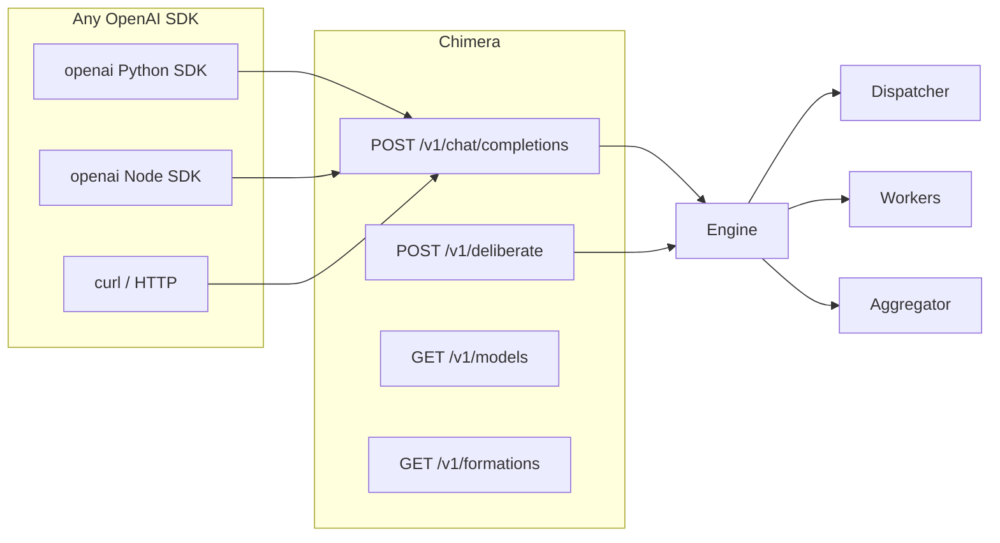

# Chimera Usage Guide

## Command-Line

```bash
# Quick deliberation
chimera deliberate "Explain the CAP theorem"

# With a specific formation
chimera deliberate "Compare Kubernetes vs Nomad" --formation debate

# Custom DAG from JSON file
chimera deliberate "Audit this architecture decision" \
  --dag my-dag.json \
  --allow-custom-dag

# Restrict models to budget tier
chimera deliberate "Write a Python decorator tutorial" \
  --allowed-models deepseek/deepseek-v4-pro deepseek/deepseek-v4-flash

# Override specific stages
chimera deliberate "..." \
  --stage-models '{"worker_1":"z-ai/glm-5.2","aggregator":"openrouter/anthropic/claude-sonnet-4"}'

# Enable debug logging
chimera deliberate "..." --log-level debug

# List available models
chimera models

# List formation presets
chimera formations

# Start API server
chimera serve --port 8080

# With custom config path
chimera --config /path/to/chimera.yaml deliberate "..."
```

## REST API



## Python SDK Example

```python
from openai import OpenAI

client = OpenAI(base_url="http://localhost:8000/v1", api_key="local")

# Simple
r = client.chat.completions.create(
    model="auto",
    messages=[{"role": "user", "content": "Explain monads in Haskell"}]
)
print(r.choices[0].message.content)

# With Chimera features
r = client.chat.completions.create(
    model="auto",
    messages=[{"role": "user", "content": "Review this SQL schema for performance"}],
    extra_body={
        "allowed_models": ["deepseek/deepseek-v4-pro", "z-ai/glm-5.2"],
        "stage_models": {"aggregator": "openrouter/anthropic/claude-sonnet-4"},
    }
)
```

## MCP (Hermes Integration)

Chimera exposes three MCP tools for AI agents:

```
chimera_deliberate(prompt, formation?) → answer + trace
chimera_formations()                    → available presets
chimera_models()                        → model catalog
```

Register with Hermes:

```yaml
# ~/.hermes/config.yaml
mcp_servers:
  chimera:
    command: chimera-mcp
    args: [/path/to/chimera.yaml]
```

Then from Hermes chat:

```
> Use chimera to compare React and Svelte for our dashboard
```

## Common Patterns

### Budget-First (default)

Best for: most queries, keeping costs low

```yaml
defaults:
  dispatcher: deepseek/deepseek-v4-flash
  default_worker: deepseek/deepseek-v4-pro
  default_aggregator: deepseek/deepseek-v4-flash
  lock_aggregator: true
```

### Premium Analysis

Best for: critical decisions, complex analysis, code review

```json
{
  "model": "auto",
  "dispatcher_model": "z-ai/glm-5.2",
  "allowed_models": [
    "openrouter/anthropic/claude-sonnet-4",
    "z-ai/glm-5.2",
    "deepseek/deepseek-v4-pro"
  ],
  "stage_models": {
    "aggregator": "openrouter/anthropic/claude-sonnet-4"
  }
}
```

### Code Review Pipeline

DAG: coder → reviewer → security-auditor → merge

```yaml
code-review:
  dag:
    stages:
      - {id: coder, kind: worker, model: deepseek/deepseek-v4-pro}
      - {id: reviewer, kind: aggregator, model: z-ai/glm-5.2, depends_on: [coder]}
      - {id: security, kind: audit, model: openrouter/anthropic/claude-haiku-4.5, depends_on: [reviewer]}
    edges:
      - [coder, reviewer]
      - [reviewer, security]
```

### Research Deep-Dive

3 experts → 2 debaters → judge

```yaml
deep-research:
  dag:
    stages:
      - {id: domain_expert, kind: worker, model: deepseek/deepseek-v4-pro}
      - {id: skeptic, kind: worker, model: openrouter/anthropic/claude-sonnet-4}
      - {id: synthesizer, kind: worker, model: z-ai/glm-5.2}
      - {id: debate_1, kind: aggregator, model: openrouter/anthropic/claude-sonnet-4, depends_on: [domain_expert, skeptic]}
      - {id: debate_2, kind: aggregator, model: z-ai/glm-5.2, depends_on: [domain_expert, synthesizer]}
      - {id: judge, kind: merge, model: openrouter/anthropic/claude-sonnet-4, depends_on: [debate_1, debate_2]}
    edges:
      - [domain_expert, debate_1]
      - [skeptic, debate_1]
      - [domain_expert, debate_2]
      - [synthesizer, debate_2]
      - [debate_1, judge]
      - [debate_2, judge]
```

## Observability

### Debug Logs

```yaml
observability:
  log_level: debug
  use_stdout: true
```

With debug logging, Chimera outputs:
- Full dispatcher prompt and response
- Each worker's custom prompt
- Aggregator merge instructions
- Per-stage token counts and latency
- Response format retry attempts

### Langfuse Tracing

```yaml
observability:
  langfuse:
    enabled: true
    public_key: pk-...
    secret_key: sk-...
```

All deliberations appear as traces with nested generations per stage.

### Self-Serve Trace

Every API response includes a trace object with:
- `request_id` — unique deliberation ID
- `source` — "auto", "preset", "custom", or "fallback"
- `dispatch` — dispatcher model call details
- `workers[]` — per-worker prompts, responses, tokens, latency, cost
- `aggregator` — merge stage details
- `total_tokens`, `total_cost`, `total_duration_ms`

## Tips

1. **Start budget, escalate when needed** — default to DeepSeek, override for critical work
2. **Lock the aggregator** — prevents the dispatcher from burning budget on premium merge models
3. **Use `allowed_models` to constrain costs** — `["deepseek/deepseek-v4-pro", "deepseek/deepseek-v4-flash"]`
4. **Debug with `log_level: debug`** — see exactly what prompts each model gets
5. **Define custom formations in config** — reusable, version-controlled DAGs
6. **Always check `source` in trace** — "fallback" means the dispatcher failed and you got a basic template
