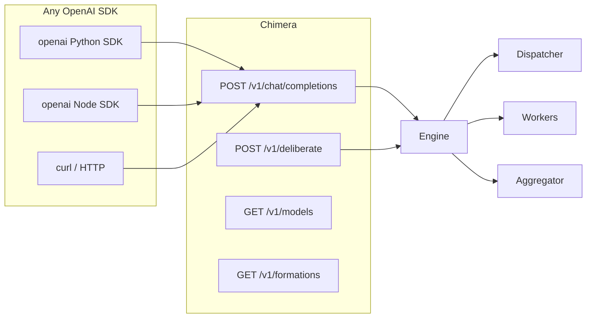

# Chimera Usage Guide

## Command-Line

```bash
# Quick deliberation
chimera run "Explain the CAP theorem"

# With a specific formation (flags go BEFORE the subcommand)
chimera --formation debate run "Compare Kubernetes vs Nomad"

# Custom DAG as an inline JSON string (requires --allow-custom-dag)
chimera --dag '{"stages":[{"id":"researcher","kind":"worker","model":"deepseek/deepseek-v4-flash"},{"id":"finalizer","kind":"aggregator","model":"deepseek/deepseek-v4-pro","depends_on":["researcher"]}],"edges":[["researcher","finalizer"]]}' \
  --allow-custom-dag run "Audit this architecture decision"

# Restrict models to budget tier (per-stage overrides)
chimera --stage-models '{"worker_1":"deepseek/deepseek-v4-flash","aggregator":"deepseek/deepseek-v4-flash"}' \
  run "Write a Python decorator tutorial"

# Override specific stages
chimera --stage-models '{"worker_1":"zai-coding-plan/glm-5.2","aggregator":"deepseek/deepseek-v4-pro"}' \
  run "..."

# Unknown stage ids are rejected (exit 2) with the valid stage ids listed —
# a typoed id never silently drops its override behind a normal answer.

# Print the full deliberation trace
chimera --verbose run "..."

# Machine-readable output (flags go BEFORE the subcommand)
chimera --quiet run "..."            # stdout = the raw answer + one newline
chimera --json run "..."             # stdout = one JSON object (answer + trace)

# List available models
chimera models

# List formation presets
chimera formations

# Print the package version
chimera --version

# Start API server
chimera serve --port 8080

# With custom config path
chimera --config /path/to/chimera.yaml run "..."
```

### Quiet and JSON output

`--quiet` and `--json` are mutually exclusive group flags, so they are
written before the subcommand. Both work with the implicit-prompt form
(`chimera "..."`, same as `chimera run "..."`):

```bash
# stdout is EXACTLY the answer plus one trailing newline — no panel, no
# ANSI, no trace, no warning text. Everything diagnostic goes to stderr.
chimera --quiet "Summarize this changelog"
chimera --quiet run "Summarize this changelog"

# Capture it
ANSWER=$(chimera --quiet "Name one HTTP status code for 'not found'")

# stdout is EXACTLY one JSON object: {"answer": ..., "trace": {...}}
chimera --json "Compare React and Vue" > out.json
jq -r .answer out.json
jq .trace.total_tokens out.json

# Explicit run form is identical
chimera --json run "Compare React and Vue"
```

The `trace` value is the complete trace serialization
(`DeliberationTrace.model_dump(mode="json")`) — every field the REST API
returns, including `dispatch`, `stages`, `worker_failures`, `dispatch_note`,
`dispatch_repairs`, token and cost totals. Unicode is preserved
(`ensure_ascii=False`), so `café` is written as `café`, never `caf\u00e9`.

Streams and exit codes:

| Situation | stdout | stderr | exit |
|---|---|---|---|
| `--quiet`, healthy run | the answer + `\n` | logs only | 0 |
| `--quiet`, dropped worker or degraded dispatch | the answer + `\n` | `warning: ...` lines | 0 |
| `--json`, healthy run | one JSON object + `\n` | logs only | 0 |
| `--json`, dropped worker or degraded dispatch | one JSON object + `\n` | `warning: ...` lines | 0 |
| `--quiet --json` together | (empty) | `Error: --quiet and --json are mutually exclusive` | 2 |
| unknown `--formation` value | (empty) | `error: Unknown formation: <value>` + the available names | 2 |
| missing `chimera.yaml` | `error: ...` one-liner | logs only | 2 |

Notes:

- Operational truth is never hidden: the dropped-worker and
  dispatch-degradation/repair warnings that human mode prints beside the
  panel are written to **stderr** in the machine modes (the JSON's
  `trace.worker_failures` / `trace.dispatch_note` / `trace.dispatch_repairs`
  carry the same facts machine-readably).
- `--verbose` is ignored under `--quiet` / `--json` — the trace is already in
  the JSON, and `--quiet` stays a single line.
- The flags govern DELIBERATION output (the `run` path). `chimera models` and
  `chimera formations` keep their human tables unchanged — for a
  machine-readable catalog use the REST API (`GET /v1/models`,
  `GET /v1/formations`) or the MCP tools.
- Default (no flag) and `--verbose` human output are unchanged: boxed answer
  panel on stdout, warnings beside it, optional trace table.

### Unknown formations (all four surfaces)

An unknown `--formation` name is rejected, never silently swapped for `auto`:

| Surface | Behavior on an unknown formation |
|---|---|
| CLI | `error: Unknown formation: <value>. Available formations: ...` on **stderr**, exit **2**, no provider call and no billing |
| REST | `POST /v1/deliberate` → HTTP **422** `{"detail": "Unknown formation: <value>"}` |
| MCP | `chimera_deliberate` → `{"error": "unknown_formation", "formation": ..., "available": [...]}` |
| WEB | `POST /web/sessions/{id}/chat` → HTTP **422** `{"detail": "Unknown formation: <value>. Available formations: ..."}` |

Run `chimera formations` (or `GET /v1/formations` / the `chimera_formations`
MCP tool) to discover the valid names. An explicit `--dag` payload replaces
formation selection, so `--dag` invocations are exempt from this check.

### Module entry point (`python -m chimera`)

The package also exposes the same CLI as a module, so it stays reachable when
the `chimera` console script is **not** on `PATH` — a fresh clone, a venv that
has not been activated, or a bare wheel installed without scripts:

```bash
python -m chimera --version                 # same as `chimera --version`
python -m chimera run "Explain the CAP theorem"
python -m chimera --json run "..."          # flags and subcommands are identical
```

`python -m chimera` runs the same entry point as the console script
(`chimera.cli.main:main`), so every subcommand, flag, exit code and stream
guarantee documented above applies unchanged. Reach for it whenever
`command -v chimera` prints nothing.

## REST API


```mermaid
flowchart LR
    subgraph "Any OpenAI SDK"
        SDK[openai Python SDK]
        SDK2[openai Node SDK]
        SDK3[curl / HTTP]
    end

    SDK --> API
    SDK2 --> API
    SDK3 --> API

    subgraph Chimera
        API["POST /v1/chat/completions"]
        API2["POST /v1/deliberate"]
        API3["GET /v1/models"]
        API4["GET /v1/formations"]
    end

    API --> Engine
    API2 --> Engine
    Engine --> D[Dispatcher]
    Engine --> W[Workers]
    Engine --> A[Aggregator]
```

## Python SDK Example

```python
from openai import OpenAI

client = OpenAI(base_url="http://localhost:8765/v1", api_key="local")

# Simple
r = client.chat.completions.create(
    model="auto",
    messages=[{"role": "user", "content": "Explain monads in Haskell"}]
)
print(r.choices[0].message.content)

# With Chimera features
r = client.chat.completions.create(
    model="auto",
    messages=[{"role": "user", "content": "Review this SQL schema for performance"}],
    extra_body={
        "allowed_models": ["deepseek/deepseek-v4-pro", "zai-coding-plan/glm-5.2"],
        "stage_models": {"aggregator": "anthropic/claude-sonnet-4.6"},
    }
)
```

## MCP (Hermes Integration)

Chimera exposes three MCP tools for AI agents:

```
chimera_deliberate(prompt, formation?) → answer + trace
chimera_formations()                    → available presets
chimera_models()                        → model catalog
```

Register with Hermes:

```yaml
# ~/.hermes/config.yaml
mcp_servers:
  chimera:
    command: chimera-mcp
    args: [/path/to/chimera.yaml]
```

Then from Hermes chat:

```
> Use chimera to compare React and Svelte for our dashboard
```

## Common Patterns

### Budget-First (default)

Best for: most queries, keeping costs low

```yaml
defaults:
  dispatcher: deepseek/deepseek-v4-flash
  default_worker: deepseek/deepseek-v4-pro
  default_aggregator: deepseek/deepseek-v4-flash
  lock_aggregator: true
```

### Premium Analysis

Best for: critical decisions, complex analysis, code review

```json
{
  "model": "auto",
  "dispatcher_model": "zai-coding-plan/glm-5.2",
  "allowed_models": [
    "anthropic/claude-sonnet-4.6",
    "zai-coding-plan/glm-5.2",
    "deepseek/deepseek-v4-pro"
  ],
  "stage_models": {
    "aggregator": "anthropic/claude-sonnet-4.6"
  }
}
```

### Code Review Pipeline

DAG: coder → reviewer → security-auditor → merge

```yaml
code-review:
  dag:
    stages:
      - {id: coder, kind: worker, model: deepseek/deepseek-v4-pro}
      - {id: reviewer, kind: aggregator, model: zai-coding-plan/glm-5.2, depends_on: [coder]}
      - {id: security, kind: audit, model: anthropic/claude-haiku-4.5, depends_on: [reviewer]}
    edges:
      - [coder, reviewer]
      - [reviewer, security]
```

### Research Deep-Dive

3 experts → 2 debaters → judge

```yaml
deep-research:
  dag:
    stages:
      - {id: domain_expert, kind: worker, model: deepseek/deepseek-v4-pro}
      - {id: skeptic, kind: worker, model: anthropic/claude-sonnet-4.6}
      - {id: synthesizer, kind: worker, model: zai-coding-plan/glm-5.2}
      - {id: debate_1, kind: aggregator, model: anthropic/claude-sonnet-4.6, depends_on: [domain_expert, skeptic]}
      - {id: debate_2, kind: aggregator, model: zai-coding-plan/glm-5.2, depends_on: [domain_expert, synthesizer]}
      - {id: judge, kind: merge, model: anthropic/claude-sonnet-4.6, depends_on: [debate_1, debate_2]}
    edges:
      - [domain_expert, debate_1]
      - [skeptic, debate_1]
      - [domain_expert, debate_2]
      - [synthesizer, debate_2]
      - [debate_1, judge]
      - [debate_2, judge]
```

## Observability

### Health Endpoints

`GET /v1/health` reports `healthy` when every configured provider's live probe
succeeded, and `degraded` when **at least one provider probe failed** (missing
credentials, auth error, API error, or an internal error in the check). A probe
that never answered inside the budget is a third case: it is reported `slow` and
does NOT degrade `status` (see below). It always answers HTTP 200 — read the
`status` field, not the HTTP code — and `details.providers` carries
per-provider `healthy` / `error` / `model_tested`. `GET /v1/health/ready`
reuses the same probe and returns 503 when no provider is reachable. The probe
is a real (tiny) completion per provider (`max_tokens=1`), so polling costs a
small number of tokens and is bounded by `server.health_timeout_s`
(default 10 s).

**Why it is degraded, without string-matching (DF-CHIMERA-V2-14).** The
response carries the reason twice, both additive:

* top-level `unhealthy_providers` — the sorted names of the providers whose
  probe failed for a reason that says something about the provider (a
  connection failure, an HTTP 5xx, an auth rejection, an exhausted quota),
  present in every response and `[]` exactly when `status` is `healthy`;
* top-level `slow_providers` — the sorted names of the providers whose probe
  never answered inside the budget. These do NOT make `status` degraded (see
  below), so the two arrays partition the not-healthy providers by meaning;
* `details.providers.<name>.error_class` on every failed provider —
  `missing_credentials` (no resolvable key, no live call), `slow` (the probe
  never answered inside `server.health_timeout_s` — see below), `timeout` (a
  probe-side timeout: the call itself failed with a timeout), `auth`, `quota`,
  or `api` (unclassified; treat an unknown value as opaque).

So `curl -s localhost:8765/v1/health | jq -r '.unhealthy_providers[]'` lists
the offenders and `jq '.details.providers | to_entries[] | "\(.key): \(.value.error_class)"'`
names the class per provider. `GET /v1/health/ready` carries the same
`unhealthy_providers` list in its 200 body. A healthy provider has no
`error_class`; when the probe itself raises, every configured provider is named
(none was proven healthy) and `details.error` holds the real reason.

**A provider that outlives the probe budget is `slow`, not `degraded`
(DF-CHIMERA-V2-27).** A probe that never answers inside
`server.health_timeout_s` reports `error_class: "slow"` with the measured wait
in its `error` text and in a numeric `latency_s` — and, because nothing was
measured about that provider beyond "slower than the budget", it does **not**
make `/v1/health` degraded. The response names it separately in the top-level
`slow_providers` array (parallel to `unhealthy_providers`, which keeps its
meaning: providers whose probe failed for a reason that says something about
the provider — connection refused, HTTP 5xx, auth, quota).

That distinction is the point. Measured live: the `hermes` gateway injects a
~43.6k-token system prompt, so a 1-token probe takes ~108 s against the 10 s
budget while the gateway itself answers `/v1/models` in 0.33 s and the same
model called directly upstream answers in 1.9 s. Classifying that as a bare
`timeout` made `/v1/health` read `degraded` permanently — so a REAL hermes
outage was indistinguishable from the standing condition. Now:

```bash
curl -s localhost:8765/v1/health | jq '{status, unhealthy_providers, slow_providers}'
# {"status":"healthy","unhealthy_providers":[],"slow_providers":["hermes"]}
```

A slow provider is still `healthy: false` in `details.providers` (the condition
is reported, just not as a degradation), and `/v1/health/ready` still answers
503 when it is the only provider — a probe that never landed proved nothing
about reachability, so it must not satisfy a load balancer.

Two knobs follow the existing `providers.<name>.{base_url, api_key_env}` shape
when a provider's standing latency is simply outside any sane budget:

* `providers.<name>.health_probe: false` — skip the live probe for that
  provider entirely (no upstream call, no tokens). It is reported
  `probe_skipped`, named in the top-level `probe_skipped_providers`, and does
  NOT satisfy `/v1/health/ready`. It is not a way to hide a provider: the
  omission is visible in the response. Keep at least one probed provider.
* `server.health_timeout_s` — the shared budget. Raise it only if you want
  every provider's probe to be allowed to take that long.

**A probe is one attempt per model (DF-CHIMERA-V2-16).** The health probe does
not use the completion retry ladder: it makes exactly one upstream call per
model, so a provider that answers with a fast `429`/`401` is reported as
`quota`/`auth` with its own message and reset time — never retried with backoff
until the shared `server.health_timeout_s` budget expires and the verdict
becomes a fabricated `timeout`. Retry policy (`config.retry`) is unchanged for
real completions.

**A probe landing just past the budget is not a timeout (DF-CHIMERA-V2-17).**
Probes still outstanding when the `server.health_timeout_s` budget expires get
`server.health_probe_grace_s` extra seconds (default 1.0) to finish, and one
that lands inside the grace reports its real verdict (`quota`/`auth`/`api`
with `model_tested`) instead of a fabricated `timeout` — the measured
cold-start case, where litellm's one-off client warm-up briefly exceeds the
budget on the first `/v1/health` call after a restart. Set
`health_probe_grace_s: 0` to cancel at the deadline exactly as before.

### Live Smoke Test

Health endpoints do not prove a deliberation works. After a deploy (or whenever
the deployment is suspect):

```bash
python scripts/smoke_live.py --base-url http://localhost:8765
python scripts/smoke_live.py --base-url http://myhost:8765 --formation auto
CHIMERA_API_KEY=... python scripts/smoke_live.py --base-url http://myhost:8765
```

The flag is `--base-url` (there is no `--port`); `CHIMERA_BASE_URL` sets the
default. It verifies liveness + the running commit, probes `/v1/health`, then
POSTs a real `/v1/deliberate` and prints the merged answer. Exit 0 = answer
received, 1 = failure (auth/formation/busy/provider hints), 2 = usage error.

**How the provider lines read (DF-CHIMERA-V2-4).** The probe's report is split by
meaning, because a fresh install and a real degradation used to print identical
words:

* `providers: <healthy>/<total> healthy` — counted from the payload's provider
  map, never from `providers_configured` (that counts providers **explicitly
  declared in the config**, excluding auto-discovery additions — see
  `providers_discovered` for those — and says nothing about whether any of them
  answered);
* `INFO: providers without a configured API key (expected on a fresh install): …`
  — providers whose `error_class` is `missing_credentials` (see the health
  section above). No key configured is normal on a new deployment, so the
  deliberation below is the real proof it works;
* `WARNING: providers reported unhealthy by /v1/health: <name> [<class>] …` — any
  other class (`timeout`, `auth`, `quota`, `api`, `unknown`), each provider named
  with its class, plus the provider's own message when it sends one (e.g. a quota
  reset time). A `slow` provider (DF-CHIMERA-V2-27) is NOT in this list — see the
  INFO line below;
* `INFO: providers slower than the probe budget (not a failure — the probe never
  landed; a real call may still work): <name> [slow]: …` — providers the server
  classified `slow` (never answered inside `server.health_timeout_s`), with the
  measured wait. Information rather than a warning, because nothing about the
  provider was measured beyond its latency;
* `INFO: providers whose live health probe is disabled (health_probe: false): …`
  — providers explicitly opted out of probing. Nothing was measured, so the line
  keeps the omission visible.

None of these lines changes the exit code: the provider block never fails the run, so a
degraded provider list still exits 0 when the deliberation succeeds.

### Blocked models (a present-but-invalid provider key)

A key that is *present* but wrong or expired is not visible to config
validation — `provider_credential_resolved` can only report that something
resolved. It is detected on the first real failure instead: an auth-class
rejection (`401` / `AuthenticationError` / "User not found" / "invalid API
key") marks the model as **blocked** exactly like a provider guardrail
rejection does. The run still completes (exit 0) with the surviving stages,
but three things now happen:

* the model is recorded in `~/.chimera/blocked-models.json` for the block
  cooldown (7 days by default) with a **non-reversible fingerprint** of the
  key that failed — never the key itself;
* the dispatcher/driver stops assigning it: it is dropped from the auto
  catalog *and* from worker stages, including a worker that names it
  explicitly (`--stage-models`), which is replaced by a credentialed
  fallback model instead of burning another doomed call;
* the CLI prints an actionable warning on stderr naming the stage, model,
  provider and the env var to fix:

```
warning: worker 'worker_1' (openrouter/openai/gpt-5.6-sol) failed: litellm.AuthenticationError: ...
  credential failure: provider 'openrouter' rejected the API key for openrouter/openai/gpt-5.6-sol.
  fix: set a valid OPENROUTER_API_KEY (or unset the stale one) and re-run — the model is excluded
  from selection until the key changes or the block cooldown expires (~/.chimera/blocked-models.json).
```

**See the exclusions:** `~/.chimera/blocked-models.json` (entries carry
`blocked_until_epoch`, `reasons` and `credential_fingerprints`), or
`chimera models`, which lists a `Blocked models` block with the reason and
the remedy per model.

**Clear a block:** fix or replace the key. The block **self-clears** on the
next run as soon as the credential the config resolves differs from the
fingerprint that was recorded — no file surgery needed. To clear it by hand,
delete the entry from `~/.chimera/blocked-models.json` (or the whole file).
Blocks expire on their own after the cooldown as well.
`auto_formation.restrict_to_credentialed_providers: false` keeps the full
catalog visible to the dispatcher (the pre-restriction behavior); it does not
make a bad key work, and a credential-blocked model is still not assigned to
a worker stage.

Timeouts, `429` and `5xx` are deliberately **not** blocked this way: those
are transient and handled by retries/circuit breaking.

### Debug Logs

```yaml
observability:
  log_level: debug
  use_stdout: true
```

With debug logging, Chimera outputs:
- Full dispatcher prompt and response
- Each worker's custom prompt
- Aggregator merge instructions
- Per-stage token counts and latency
- Response format retry attempts

### Langfuse Tracing

```yaml
observability:
  langfuse:
    enabled: true
    public_key: pk-...
    secret_key: sk-...
```

All deliberations appear as traces with nested generations per stage.

### Self-Serve Trace

Every API response includes a trace object with:
- `request_id` — unique deliberation ID
- `source` — "auto", "preset", "custom", or "fallback"
- `dispatch` — dispatcher model call details
- `workers[]` — per-worker prompts, responses, tokens, latency, cost
- `aggregator` — merge stage details
- `total_tokens`, `total_cost`, `total_duration_ms`

## Tips

1. **Start budget, escalate when needed** — default to DeepSeek, override for critical work
2. **Lock the aggregator** — prevents the dispatcher from burning budget on premium merge models
3. **Use `allowed_models` to constrain costs** — `["deepseek/deepseek-v4-pro", "deepseek/deepseek-v4-flash"]`
4. **Debug with `log_level: debug`** — see exactly what prompts each model gets
5. **Define custom formations in config** — reusable, version-controlled DAGs
6. **Always check `source` in trace** — "fallback" means the dispatcher failed and you got a basic template
